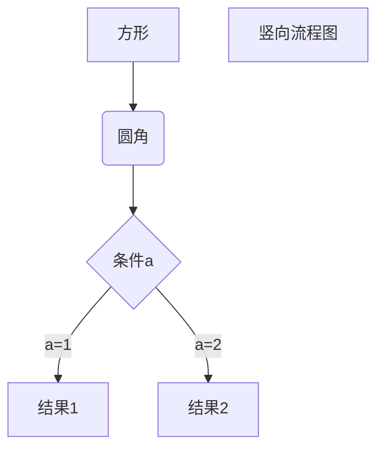

# 什么是机器学习

## 两种定义  

1. 无需准确编程就能使计算机获得学习能力的研究领域  
>`Arthur Samuel`：the field of study that gives computers the ability to learn without being explicitly programmed.  

2. 一个计算机程序学习关于某类任务T的经验E，其中T的性能表现由P进行测量，如果这个程序在任务T上表现被P测量为提升，即(该程序)学习了经验E

>`Tom Mitchell`：A computer program is said to learn from experience E with respect to some class of tasks T and performance measure P, if its performance at tasks in T, as measured by P, improves with experience E.  

**Example**: *playing checkers*.  
**E** = `the experience of playing many games of checkers`  
**T** = `the task of playing checkers`  
**P** = `the probability that the program will win the next game`  

## 运用领域  

1. 数据挖掘`Database Mining`  
   
    网页点击数据，医疗记录，生物学，工程学等  
2. 无法人工编程的应用  
   
    自动驾驶，手写识别，NLP，计算机视觉等  
3. 自定式程序  
   
    Amazon的推荐系统等  
4. 理解人类学习方式  

> 机器学习在十二项IT技术人员必备技能中排第一  

# 机器学习算法  

## 分类  

1. 监督式学习`Supervised learning`  
    包括：回归`Regression`和分类`Classification` 

2. 非监督式学习`Unsupervised learning`  
    包括：聚类`Clustering`  

3. 强化学习`Reinforcement learning`  

4. 推荐系统`Recommender systems`

## 回归算法

监督式学习算法中能对每个数据样例，能够给出确定的回答。能够预测**实际数值**的称之为回归。  

对于一个训练数集，有如下概念：  
**m** = ·`Number of training examples`  训练集大小  
**x** ’s = `"input" variable/features` 输入变量或特征  
**y** ’s = `"output" variable/"target" variable` 输出变量或目标变量  




$$
\mathbf{V}_1 \times \mathbf{V}_2 =  
\begin{vmatrix} 
\mathbf{i} \\\\\\
\frac{\partial X}{\partial u} \\\\\\
\frac{\partial X}{\partial v} 
\end{vmatrix} 
$$


```flow
st1=>start: Training Set
st2=>input: X
op1=>operation: Learning Algroithm
op2=>operation: h
e=>output: Y
st1->op1->op2
st2->op2->e
```
```flow
st=>start: 开始框
op=>operation: 处理框
cond=>condition: 判断框(是或否?)
sub1=>subroutine: 子流程
io=>inputoutput: 输入输出框
e=>end: 结束框
st->op->cond
cond(yes)->io->e
cond(no)->sub1(right)->op
```
```flow
st=>start: Start
op=>operation: Your Operation
cond=>condition: Yes or No?
e=>end
st->op->cond
cond(yes)->e
cond(no)->op
```