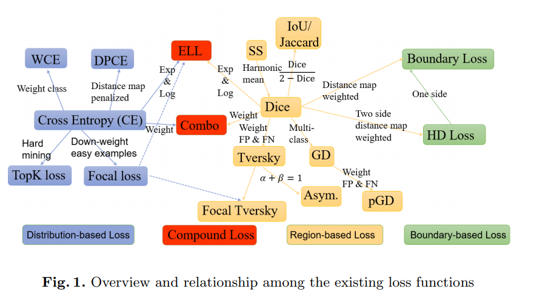

# 两篇文章

1. [A survey of loss function for semantic segmentation](https://arxiv.org/abs/2006.14822v4)

**Authors**：Shruti Jadon

**Departments**：University of Massachusetts, College of Information and Computer Science, IEEE Member

**Journal**： 2020 IEEE Conference on Computational Intelligence in Bioinformatics and Computational Biology (CIBCB)

2. [Segmentation Loss Odyssey](https://arxiv.org/pdf/2005.13449.pdf)

**Authors**：Jun Ma

**Departments**：Department of Mathematics, Nanjing University of Science and Technology

**Journal**： arXiv:2005.13449

## 四类Loss Function

### Distribution-based Loss

基于分布的损失函数旨在最小化两分布之间差异。

#### Binary Cross-Entropy

**Cross-Entropy**：一个给定的随机变量或一组事件的两个概率分布之差的度量，由Kullback-Leibler散度推导而来。

$$
L_{CE}(y, \hat y) = - (y log(\hat y) + (1 - y)log(1 - \hat y))
$$

其中$\hat y$是模型的预测概率，$y$是标注值

#### Weight Binary Cross-Entropy

$$
L_{W-BCE}(y, \hat y) = - (\beta * y log(\hat y) + (1 - y)log(1 - \hat y))
$$

通过调控$\beta$大小控制假阴假阳的分量

#### Balance Cross-Entropy

$$
L_{BCE}(y, \hat y) = - (\beta * y log(\hat y) + (1 - \beta) (1 - y)log(1 - \hat y))
$$

$\beta = 1 - \frac{y}{H * W}$，$H$和$W$应该是image的高和宽

#### Focal Loss

也是BinaryCE的一个变种，当图片像素差别很大时(非常不平衡的分类场景)效果明显。

$$
L_{FL}(p_t) = -(1 - p_t)^\gamma log(p_t)
$$

其中，$\gamma$是聚焦因子，$(1 - p_t)^\gamma$是调制因子，用于减少分类良好的实例。

$p_t$定义如下：

$$
p_t = 
\begin{cases}
p & \text{if } y = 1 \\
1 - p & \text{otherwise}
\end{cases}
$$

$y$是标注结果，$p$是预测概率

在实践中加上参数$\alpha_t$效果更好

#### Distance map derived loss penalty term

通过距离图(`Distance Maps`)加权计算交叉熵，距离图由ground truth masks导出。目的在于引导网络聚焦到难以分割的边界区域。

$$
L_{DPCE} = (1 + D) \circ L_{CE}
$$

### Region-based Loss

基于区域的损失函数旨在真实区域`G`和预测区域`S`之间进行最小化错误匹配或最大化重叠区

#### Sensitivity-specificity loss

敏感度-特异性损失，通过提高特异性的权重来解决不平衡。

$$
\begin{aligned}
& L_{SS} = w * sensitivity + (1 + w) * specificity\\
\\
& sensitivity = \frac{TP}{TP + FN}\\
& specificity = \frac{TN}{TN + FP}
\end{aligned}
$$

#### IoU Loss

$$
L_{IoU} = 1 - \frac{y \hat Y}{y + \hat y - y \hat y}
$$

#### Dice Loss

**Dice Coefficient: **用于计算两个样本的相似度$s = \frac{2 |X \cap Y|}{|X| + |Y|}$

$$
DL(y, \hat y) = 1 - \frac{y \hat y + \epsilon}{y + \hat y + \epsilon} - \frac{(1 - \hat y)(1 - y) + \epsilon}{2 - \hat y - y + \epsilon}
$$

#### Generalized Dice Loss

$$
GD = 1 - 2\frac{y \hat y + 1}{y + \hat y + 1}
$$

#### Tversky Loss

在精度$p = \frac{TP}{TP + FP}$和召回率$R = \frac{TP}{TP + FN}$之间平衡
$$
TL(y, \hat y) = \frac{1 + y \hat y}{1 + y \hat y + \beta(1 - y)\hat y + (1 - \beta)y(1 - \hat y)}
$$

#### Focal Tversky Loss

$$
FTL = (1 - TL)^{\frac{1}{\gamma}}, \gamma \in [1,3]
$$

#### Asymmetric Similarity Loss

令$P$和$G$分别为"预测"和"真实"二进制标签的集合，由`Dice Coefficient` 和$F_{\beta} = (1 + \beta^2) \frac{PR}{\beta ^2P + R}$得分值可得：
$$
ASL(P, G, \beta) = \frac{(1 + \beta ^2) |PG|}{(1 + \beta ^2)|PG| + \beta ^2|G/P| +|P/G|}
$$

#### Penalty Loss

$$
PL = \frac{GD}{1 + k(1 - GD)}
$$

### Boundary-based Loss

基于边界得损失函数得目的是使得真实边界和预测分割之间得距离最小。

#### Boundary Loss

为了以可微的方式计算两边界间的距离$Dist(\partial G, \partial S)$，边界损失采用边界上的积分代替区域上的不平衡积分，以缓解高度不平衡分割的困难。

